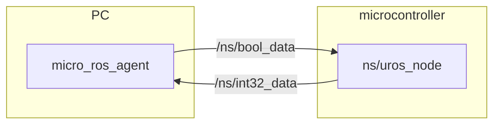

# micro_ros_arduino_simpler_projects

## Requirements

- PlatformIO (Arduino core)

- [micro_ros_arduino_simpler](https://github.com/NITKK-ROS-Team/micro_ros_arduino_simpler)
- [micro_ros_arduino (NITKK-ROS-Team)](https://github.com/NITKK-ROS-Team/micro_ros_arduino)

<br>

## Example program

### pub_sub_counter

If "`/ns/bool_data`" is true, the value in `/ns/int32_data` is incremented every second.



**Terminal 1**

```bash
docker run -it --rm --privileged --net=host microros/micro-ros-agent:humble udp4 --port 2000
```

**Terminal 2**

```bash
ros2 topic pub /ns/bool_data std_msgs/msg/Bool data:\ true\
```

**Terminal 3**

```bash
ros2 topic echo /ns/int32_data
```

